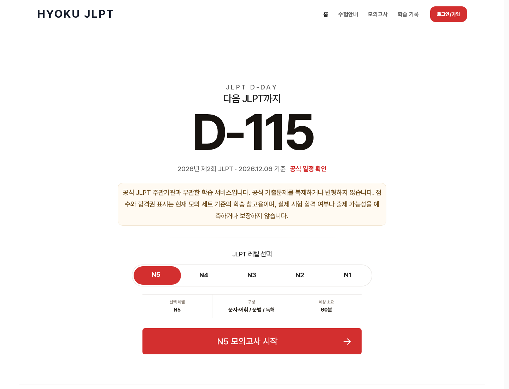

# HYOKU JLPT

🗓 개발기간 : 2026년 7월 ~ 2026년 8월  
💬 [HYOKU JLPT에서 모의고사 사이트](https://jlpt.hyoku.cloud)  
📦 [GitHub Repository](https://github.com/dltkdgur1123/jlpt-quiz-agent)

> HYOKU JLPT는 공식 JLPT 주관기관과 무관한 학습 서비스입니다. 공식 기출문제를 복제하거나 변형하지 않으며, 점수와 합격권 표시는 현재 모의 세트 기준의 학습 참고용입니다.

<br />

# 목차

1. [프로젝트 소개](#-프로젝트-소개)
2. [주요 기능](#-주요-기능)
3. [기술 스택](#-기술-스택)
4. [디렉토리 구조](#%EF%B8%8F-디렉토리-구조)
5. [검증 및 운영](#-검증-및-운영)
6. [로컬 실행 방법](#-로컬-실행-방법)
7. [데이터 및 신뢰성 원칙](#-데이터-및-신뢰성-원칙)
8. [보안 보완 사항](#-보안-보완-사항)

<br />

# 📖 프로젝트 소개

`HYOKU JLPT`는 JLPT 학습자가 시험일을 확인하고, N1~N5 레벨별 비청해 모의고사를 풀며, 제출 후 결과 리포트와 오답 복습 흐름을 확인할 수 있는 학습 서비스입니다.

기존 JLPT 학습은 PDF나 문제집 중심이라 모바일에서 반복 풀이, 결과 확인, 오답 복습 흐름을 이어가기 어렵다는 문제가 있습니다. 이 프로젝트는 Next.js와 Supabase를 기반으로 모의고사 풀이, 로그인 기반 기록 저장, 오답노트, 내부 콘텐츠 품질 검증 리포트를 하나의 웹서비스로 구성했습니다.

<br />

# 📝 주요 기능

✅ `JLPT D-Day 및 N1~N5 레벨 선택`  
홈 화면에서 다음 JLPT까지 남은 기간을 확인하고, N1~N5 중 원하는 레벨의 모의고사를 바로 시작할 수 있습니다.


<br /><br />

✅ `AI 자동화 YouTube Shorts 학습 루프`  
메인 페이지에는 AI 자동화로 운영 중인 YouTube JLPT Shorts 채널의 레벨별 최신 영상 썸네일을 연결했습니다. 사용자는 YouTube Shorts에서 단어와 문법을 먼저 학습하고, 해당 학습 콘텐츠에서 정리된 데이터가 모의고사 문항 생성 흐름으로 이어집니다. Shorts가 업로드될 때마다 학습 데이터 자동화 흐름을 통해 모의고사 데이터도 함께 보강되는 구조입니다.


<br /><br />

✅ `모의고사 시작 안내`  
시험 시작 전 문항 수, 제한 시간, 청해 제외 여부, 해설 공개 시점을 안내합니다. 공식 시험과 혼동되지 않도록 학습 참고용 서비스라는 안내도 함께 제공합니다.

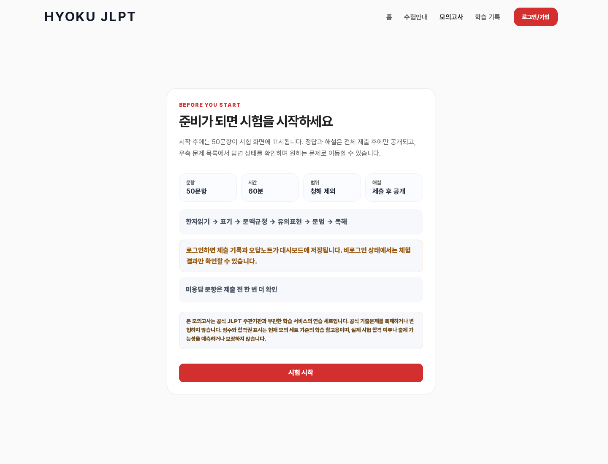

<br /><br />

✅ `50문항 실전형 문제 풀이`  
문자·어휘, 문법, 독해 영역의 50문항을 한 화면에서 풀 수 있습니다. 문제는 공식 기출문제가 아니라, AI 자동화로 운영 중인 YouTube JLPT Shorts 학습 콘텐츠와 운영 데이터 흐름을 바탕으로 생성하고 내부 품질 리포트로 검수한 자체 제작 문항입니다. 답변 상태를 문제 목록에서 확인하고 원하는 문항으로 이동할 수 있습니다.

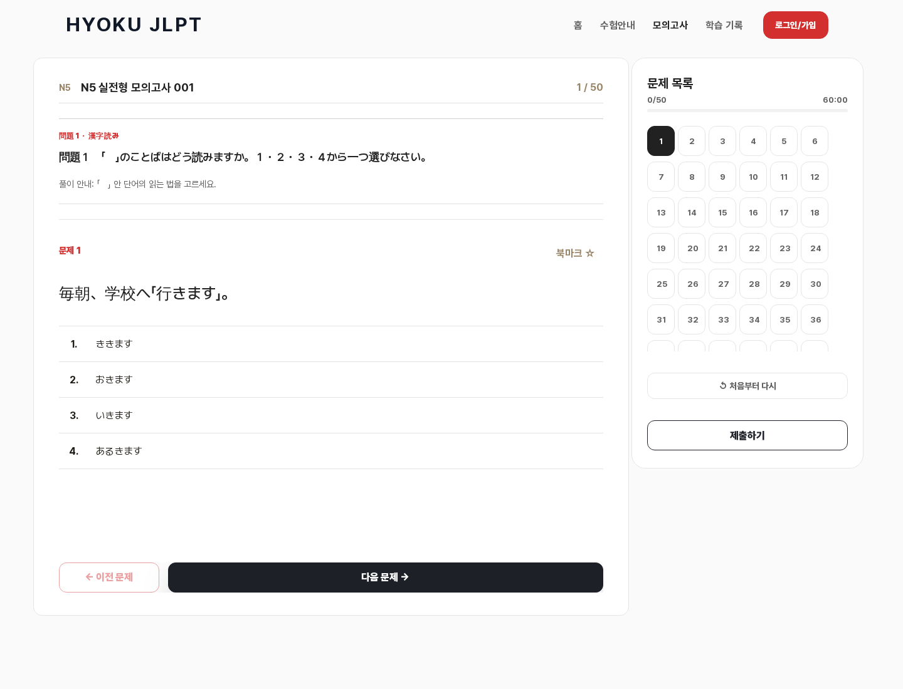

<br /><br />

✅ `제출 후 결과 리포트`  
전체 제출 후 총점, 영역별 결과, 약한 영역, 복습 우선순위를 확인할 수 있습니다. 결과는 현재 모의 세트 기준의 학습 참고용으로 표시됩니다.

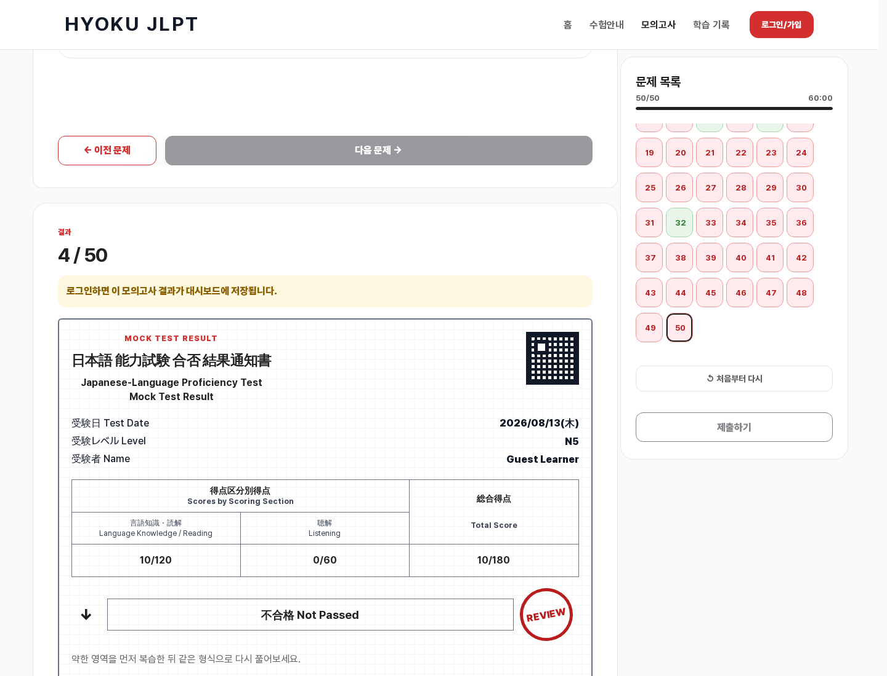

<br />

영역별 정답률과 자동 학습 코치 코멘트를 함께 제공해, 어떤 영역부터 다시 볼지 바로 결정할 수 있습니다.

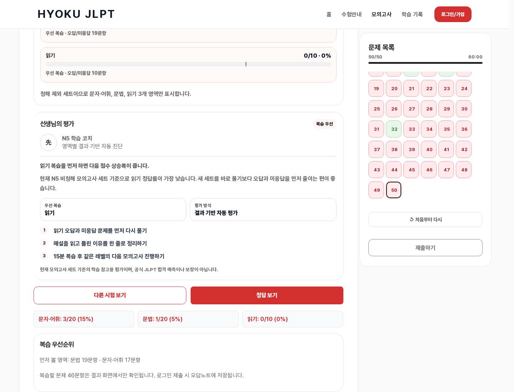

<br /><br />

✅ `로그인 및 학습 기록 저장 흐름`  
Google, Kakao, Naver, 이메일 기반 로그인을 고려한 인증 UI를 구성했습니다. 로그인 사용자는 모의고사 제출 기록과 오답 복습 흐름을 이어갈 수 있습니다.

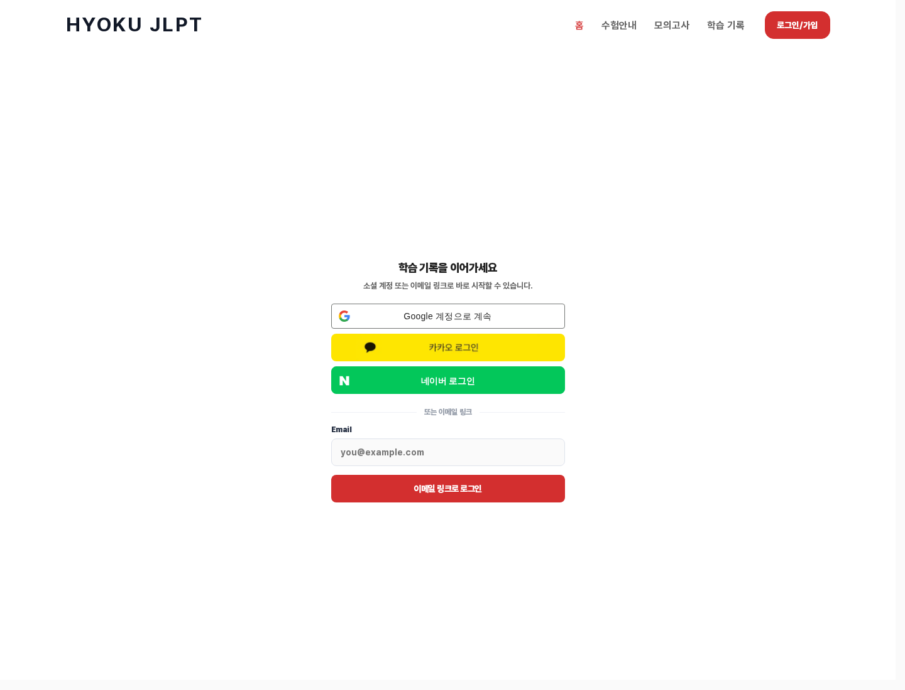

<br /><br />

✅ `학습 기록 대시보드`  
로그인 전에는 학습 기록 저장 범위를 안내하고, 로그인 후에는 최근 모의고사 기록, 평균 정답률, 남은 오답, 취약 영역, 주간 학습 활동을 한 화면에서 확인할 수 있도록 구성했습니다.

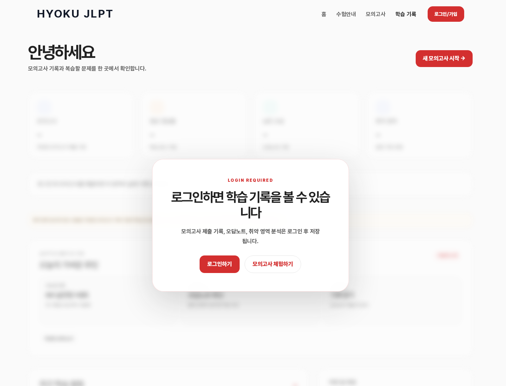

<br />

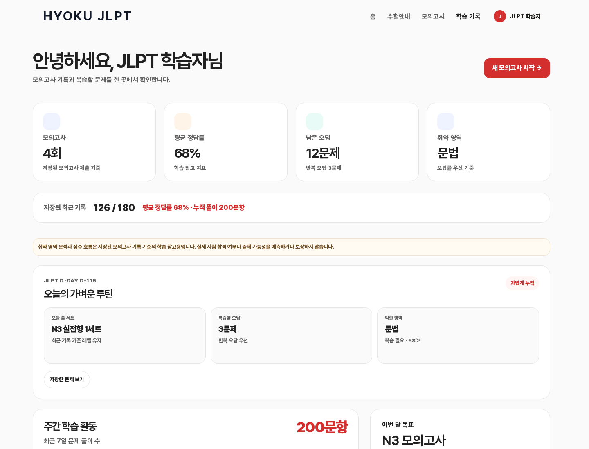

<br /><br />

✅ `오답노트 복습`  
모의고사 제출 후 틀린 문제를 다시 풀 수 있는 오답노트 흐름을 제공합니다. 실제 오답 문항, 영역 필터, 복습 진행률, 정답 확인/해설까지 연결해 반복 학습이 가능하도록 구성했습니다.

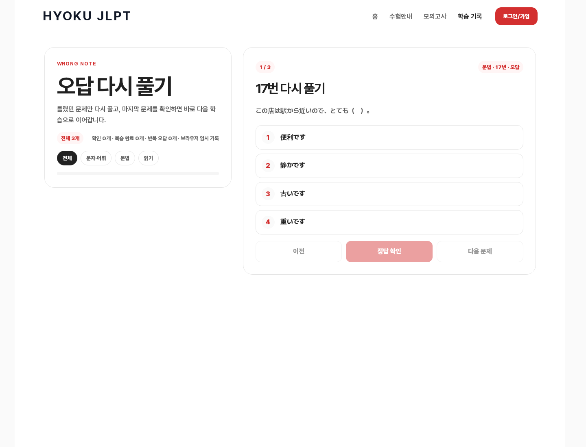

<br />

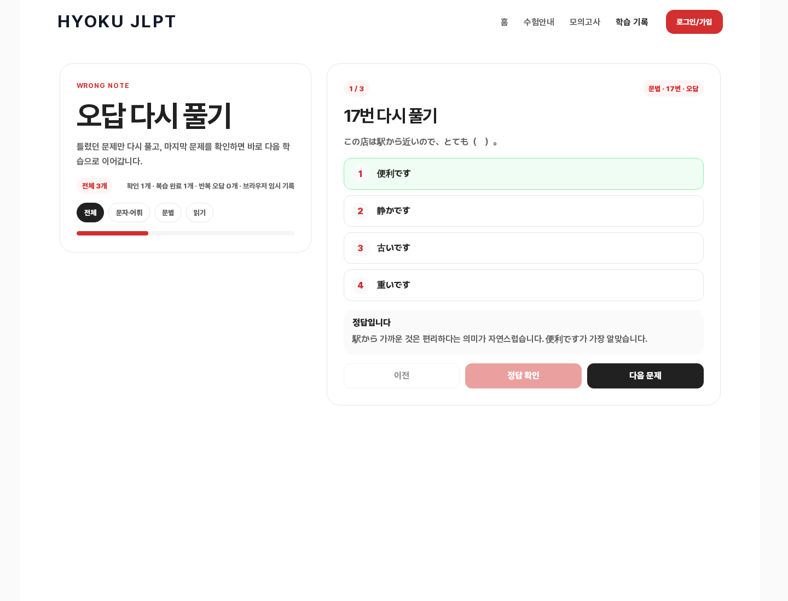

<br /><br />

✅ `AI 생성 문항 품질 검증 리포트`  
생성된 모의고사 JSON 데이터를 검사해 레벨별 세트 수, 문제 수, 영역별 구성, question type 분포, 오류/경고 여부를 확인합니다. 이 화면은 실제 사용자 홈페이지 화면이 아니라, AI 생성 문항을 공개하기 전에 검수하기 위해 GitHub 문서로 관리하는 운영 리포트입니다.

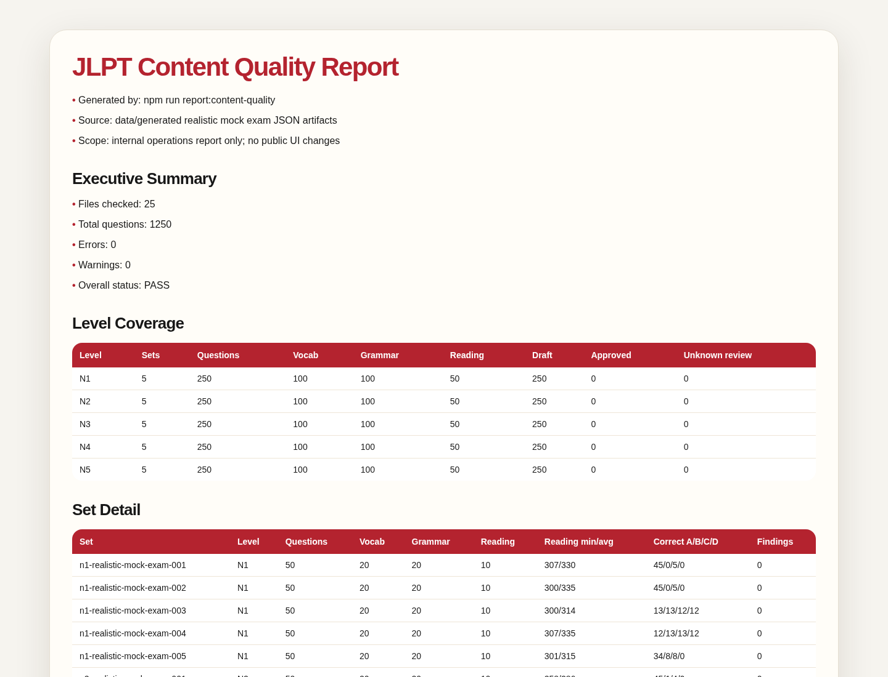

<br /><br />

✅ `모바일 반응형 화면`  
데스크톱뿐 아니라 모바일에서도 D-Day, 레벨 선택, 모의고사 진입 흐름을 빠르게 확인할 수 있도록 반응형 UI를 구성했습니다.

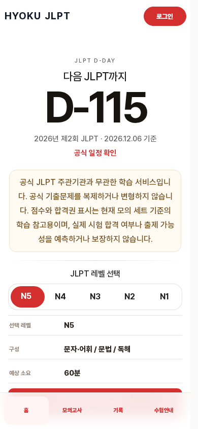

<br />

# ✨ 기술 스택

<br />

<b>Frontend / App</b>
<p align="left">
  
  
  
</p>

<b>Backend / Data</b>
<p align="left">
  
  
  
</p>

<b>Deploy / QA</b>
<p align="left">
  
  
  
</p>

<br />

# 🗂️ 디렉토리 구조

```text
jlpt-quiz-agent/
├─ src/
│  ├─ app/                         # Next.js App Router 페이지와 API route
│  │  ├─ page.tsx                  # 홈, D-Day, 레벨 선택 진입 화면
│  │  ├─ mock-exams/[level]/       # N1~N5 레벨별 모의고사 화면
│  │  ├─ dashboard/                # 학습 기록 대시보드
│  │  ├─ wrong-note/               # 오답노트 복습 화면
│  │  └─ api/                      # 퀴즈, 모의고사, 인증/기록 저장 API
│  ├─ components/                  # 화면 컴포넌트
│  │  ├─ mock-exam/                # 모의고사 실행, 결과, 오답 복습 UI
│  │  ├─ auth/                     # 로그인/가입 UI
│  │  ├─ layout/                   # 공통 헤더/푸터
│  │  └─ score/                    # 점수/체감 score 표시 컴포넌트
│  └─ lib/                         # 도메인 로직과 저장소 계층
│     ├─ mock-exam/                # 모의고사 세트 구성 및 최근 풀이 처리
│     ├─ quiz/                     # 일반 퀴즈 조회/풀이 로직
│     ├─ score/                    # 점수 계산과 출제 체감 score 로직
│     ├─ feedback/                 # 사용자 출제 경험 feedback 처리
│     └─ supabase/                 # Supabase client/repository
├─ data/
│  └─ generated/                   # N1~N5 실전형 모의고사 JSON 데이터
├─ docs/
│  ├─ assets/readme/               # README 스크린샷 이미지
│  ├─ architecture/                # 인증, 모의고사, 데이터 구조 설계 문서
│  ├─ operations/                  # 배포 후 점검, 콘텐츠 품질 리포트
│  └─ qa/                          # QA 체크리스트와 smoke test 기록
├─ scripts/
│  ├─ generate-content-quality-report.mjs  # 내부 콘텐츠 품질 리포트 생성
│  ├─ validate-realistic-mock-exam-draft.mjs
│  └─ ops-health-check.mjs
├─ supabase/
│  ├─ migrations/                  # DB schema migration
│  └─ policies/                    # RLS/auth policy 초안
└─ tests/                          # Node.js test runner 기반 테스트
```

<br />

# ✅ 검증 및 운영

현재 생성된 실전형 모의고사 데이터는 다음 기준으로 내부 리포트를 생성해 확인합니다.

```bash
npm run report:content-quality
npm run check:content-quality-report
```

현재 콘텐츠 품질 리포트 기준:

| 항목 | 결과 |
|---|---:|
| 검사 파일 | 25개 |
| 전체 문제 | 1,250문제 |
| N1 | 5세트 / 250문제 |
| N2 | 5세트 / 250문제 |
| N3 | 5세트 / 250문제 |
| N4 | 5세트 / 250문제 |
| N5 | 5세트 / 250문제 |
| 오류 | 0 |
| 경고 | 0 |

<br />

프로젝트 검증 명령어:

```bash
npm run lint
npm run typecheck
npm test
npm run build
npm run ops:health
```

최근 로컬 검증 결과:

```text
npm run check:content-quality-report  passed
node --test tests/content-quality-report.test.mjs tests/smoke.test.mjs  5 passed
npm test  156 passed
```

배포 후에는 `docs/operations/post-deploy-health-check.md` 기준으로 공개 페이지, sitemap/robots, API guard, 최근 Vercel 로그를 확인합니다.

<br />

# 💻 로컬 실행 방법

```bash
npm install
cp .env.example .env.local
npm run dev
```

필수 환경변수:

```text
NEXT_PUBLIC_SUPABASE_URL=
NEXT_PUBLIC_SUPABASE_ANON_KEY=
```

CLI 기반 Supabase 작업에만 필요한 선택 환경변수:

```text
SUPABASE_ACCESS_TOKEN=
```

`.env.local`, Supabase access token, OAuth client secret, provider secret은 커밋하지 않습니다.

<br />

# 🔐 데이터 및 신뢰성 원칙

- 공식 JLPT 주관기관과 무관한 학습 서비스로 표시합니다.
- 공식 기출문제를 복제하거나 변형하지 않습니다.
- 점수와 합격권 표시는 현재 모의 세트 기준의 학습 참고용입니다.
- 실제 시험 합격 여부나 출제 가능성을 예측하거나 보장하지 않습니다.
- 문제와 보기는 제출 전 일본어만 노출하고, 해설은 제출 후 공개합니다.
- 로그인 사용자의 모의고사 기록은 대시보드와 오답노트 흐름에 저장합니다.
- 비로그인 사용자는 결과 화면에서만 체험 결과를 확인합니다.

<br />

# 🔒 보안 보완 사항

JLPT Quiz는 공개 학습 서비스이지만 로그인, 학습 기록, 오답노트, 관리자 기능이 포함되어 있어 출시 전후로 다음 보안 항목을 보완했습니다.

## 인증·권한 보호

- Google, Kakao, Naver, 이메일 로그인을 고려한 Supabase Auth 기반 인증 흐름을 사용합니다.
- 관리자 화면과 관리자 API는 별도 allowlist 기반으로 접근을 제한합니다.
- 비로그인 사용자의 보호 API 접근은 `401/403`으로 차단되도록 점검합니다.
- 관리자 회원 목록은 기본적으로 최소 정보만 노출하도록 설계했습니다.

## 데이터 격리와 RLS

- Supabase 사용자 활동 테이블에 Row Level Security를 적용해 익명 REST 접근으로 학습 기록, 풀이 이력, 피드백 데이터가 노출되지 않도록 보완했습니다.
- `public.users`, `quiz_attempts`, `exam_seen_feedback`, mock exam attempt 관련 테이블은 anon dump 위험을 줄이기 위해 별도 lock-down migration으로 관리합니다.
- 관리자 API는 service role 서버 경로에서만 사용하고, 브라우저에는 anon/publishable key만 노출하는 원칙을 유지합니다.

## 정답 유출 방지와 서버 채점

- 문제 풀이 중에는 정답과 해설을 공개하지 않고, 제출 후 결과 화면에서만 해설을 볼 수 있도록 했습니다.
- 모의고사 채점은 클라이언트 표시값만 신뢰하지 않고 서버 측 제출·채점 흐름을 기준으로 검증합니다.
- 비로그인 체험 제출은 저장 기록과 분리해 처리하고, 로그인 사용자 저장 기록과 혼동되지 않도록 했습니다.

## 남용·비용 방지

- 공개 API 반복 호출에 대비해 주요 엔드포인트에 rate limit을 적용했습니다.
- 제한 초과 시 `429`와 `Retry-After`, `RateLimit-*` 헤더를 반환하도록 구성했습니다.
- 정상 `200` 응답에도 rate-limit 헤더를 포함해 운영 점검에서 보호 장치가 살아 있는지 확인할 수 있게 했습니다.

## 보안 헤더와 브라우저 보호

- `next.config.ts`에서 공통 보안 헤더를 설정했습니다.
  - `Content-Security-Policy`
  - `X-Frame-Options: DENY`
  - `X-Content-Type-Options: nosniff`
  - `Strict-Transport-Security`
  - `Referrer-Policy`
  - `Permissions-Policy`
- CSP는 Supabase, AdSense 등 실제 운영 연동이 깨지지 않도록 허용 도메인을 명시적으로 관리합니다.

## 개인정보·운영 감사

- 개인정보 처리방침, 이용약관, 환불 안내, 문의 페이지를 공개 페이지로 구성했습니다.
- 향후 유료 서비스 전환을 고려해 privacy deletion request, subscription 상태, admin audit event 스키마 초안을 준비했습니다.
- 관리자성 작업은 audit log를 남길 수 있는 구조로 확장했습니다.

## 운영 점검

- `npm run ops:health`에서 공개 URL, sitemap/robots, AdSense/정책 페이지, 보안 헤더, rate-limit 헤더, 주요 API guard를 점검합니다.
- 배포 후에는 `docs/operations/post-deploy-health-check.md` 기준으로 실제 운영 URL을 확인합니다.
- 모니터링 정상은 보안 리뷰 통과를 의미하지 않으므로, RLS·권한·정답 유출·관리자 접근은 별도 테스트로 확인합니다.

<br />

# 🔗 링크

- 서비스 URL: https://jlpt.hyoku.cloud
- GitHub: https://github.com/dltkdgur1123/jlpt-quiz-agent
